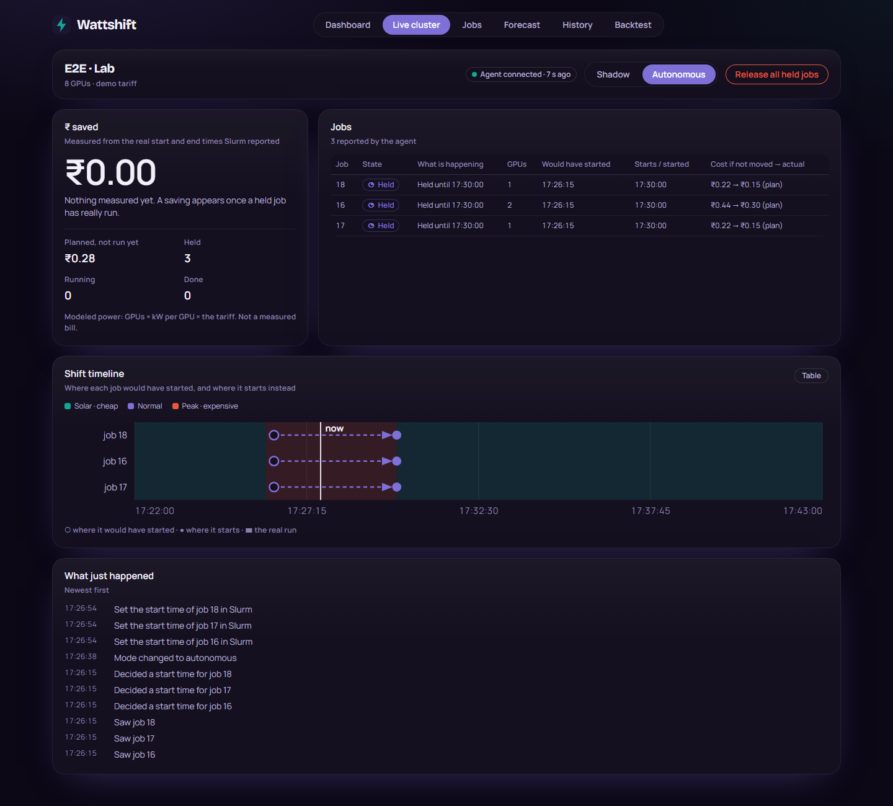

# Wattshift

Run flexible GPU jobs when electricity is cheap.

India charges different prices for electricity at different hours (time-of-day tariffs, plus the IEX day-ahead market), and
for a busy GPU cluster electricity is often the biggest running cost. Almost nobody times their jobs around it. Wattshift holds
the jobs that can wait until a cheaper hour, then measures what that saved.

This is a working showcase project, not a product on sale. The tariff is Maharashtra's (MSEDCL HT industrial, FY 2026-27, checked
against the MERC order) and the demo GPU is a Kaggle Tesla T4.



## Two ways it works

- **Submit a job.** Give it a length and a deadline. Wattshift picks the cheapest window that still meets the deadline, holds
  the job until then, and runs it on a Kaggle GPU. Each job is run twice, once at once and once at the chosen hour, and the GPU's
  own power draw is read for both, so the saving is measured, not assumed.
- **Sit next to Slurm.** A small agent watches a company's Slurm queue and, for the jobs the company allowed, sets a later start
  time inside Slurm itself. Slurm enforces it, so if the agent or the cloud goes away the jobs still start on time. It begins in
  a watch-only "shadow mode" and has an emergency release for every held job.

## What is real and what is modelled

The site says this on every page; it matters more than anything else here.

| | |
|---|---|
| **Measured** | Job start and end times (from Slurm), and the GPU's power draw on Kaggle (from `nvidia-smi`). |
| **Modelled** | The electricity a Slurm job uses (GPUs times kilowatts per GPU), so the rupee figures for the Slurm path are estimates; the percentage is the safer number. |
| **Replayed** | The fast demo clock: two minutes stand for one tariff hour. The jobs and Slurm are real; only the tariff clock is sped up. Pages say when a result came from it. |

Not done: a trial on a real company's cluster, and a check against a real electricity bill.

## Try it

You need Python 3.13, Node 20.19 or newer (or 22.12+), and a Postgres database (a free Neon one works).

```bash
# backend
cd backend
python -m venv .venv && .venv/Scripts/pip install -r requirements.txt     # Windows; use .venv/bin on Linux
# put DATABASE_URL=postgresql://... in ~/.wattshift/.env (secrets stay outside the project folder)
python -m scripts.init_db                          # tables, tariff, live IEX prices
python -m uvicorn app.main:app --port 8000

# dashboard, in a second terminal
cd frontend
npm install && npm run dev                          # http://localhost:5173, proxies /api to port 8000
```

The dashboard has six areas: the front page, a time-lapse **Live demo** of a Slurm queue, **Prices today**, **What if** (replay a
real public GPU-cluster job log against real prices), **Measured** (the with and without comparison from the GPU), and **Try it**.

The Slurm demo needs Docker: `python e2e/lab.py up`, then `python e2e/demo.py` for a narrated run of about five minutes
(see [e2e/README.md](e2e/README.md)). Running jobs on Kaggle needs a Kaggle token on your machine and `KAGGLE_USERNAME` in the same
`.env`.

## Tests

```bash
cd backend && python -m pytest        # needs TEST_DATABASE_URL: a SEPARATE database with "test" in its name, which the tests reset
cd agent && pip install -e ".[dev]" && python -m pytest
cd frontend && npm test
```

## Layout

| Folder | What it is |
|---|---|
| `backend/` | The API (FastAPI, SQLAlchemy, Postgres): planner, tariff and price data, Kaggle runner, savings and measurement, site views |
| `agent/` | The site agent that sits next to Slurm; see [agent/README.md](agent/README.md) |
| `frontend/` | The dashboard (React, TypeScript, Tailwind) |
| `e2e/` | The Docker Slurm lab, the narrated demo and the end-to-end proof |
| `docs/` | Design specs and plans, the demo storyboard, [deploy notes](docs/deploy.md) and the [security audit](docs/security/2026-09-21-audit.md) |

Older planning documents sit at the top level: `PRD.md`, `PROJECT_SPEC.md`, `SYSTEM_DESIGN.md`, `TECH_STACK.md`, `BUSINESS_CASE.md`.

## Putting it online

Neon for the database, Render for the API, Vercel for the dashboard, all on free plans: see [docs/deploy.md](docs/deploy.md).
The hosted site cannot run the Slurm demo or Kaggle jobs, which run from your own computer.

## Security

Writes need an API key, the agent reports with a per-site key, and a hostile-input test suite runs against every endpoint.
The [audit](docs/security/2026-09-21-audit.md) lists what was fixed and what is still open, including that reads are public.

## Data and credits

- Electricity prices: the Indian Energy Exchange day-ahead market (public market data).
- The "What if" job log is a real public trace from SenseTime's Helios cluster (CC-BY 4.0); see
  [backend/data/HELIOS_ATTRIBUTION.md](backend/data/HELIOS_ATTRIBUTION.md).
- Tariff numbers: MERC Case No. 75 of 2025, order of 25 March 2026.

No licence is set yet, so by default all rights are reserved.
